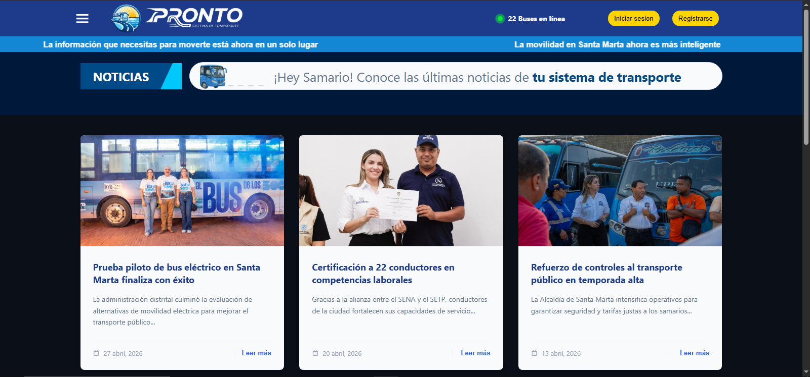

# Pronto

## Descripción

Pronto es una plataforma web de seguimiento de transporte público desarrollada como proyecto académico y parte de mi proceso de aprendizaje en desarrollo de software.

El proyecto fue diseñado con el objetivo de facilitar la consulta de rutas y la localización de autobuses en tiempo real para la ciudad de Santa Marta, ofreciendo una interfaz intuitiva que permite a los usuarios visualizar recorridos, consultar información de transporte y mejorar la planificación de sus desplazamientos.

## Imágenes

### Vista principal

### Sección de noticias

## Tecnologías utilizadas

* Vue.js
* JavaScript
* HTML5
* CSS3
* Leaflet
* OpenStreetMap
* Vercel
* Render
* Supabase

## Características

* Consulta de rutas de transporte
* Visualización de recorridos
* Localización de autobuses
* Navegación intuitiva
* Gestión de información de transporte público

## Aprendizajes

Durante el desarrollo de este proyecto fortalecí mis conocimientos en:

* Desarrollo frontend con Vue.js y JavaScript
* Creación y reutilización de componentes
* Consumo e integración de APIs
* Autenticación mediante tokens
* Organización y estructuración de proyectos web
* Control de versiones utilizando Git
* Trabajo colaborativo mediante GitHub

## Sitio web

[Visita Pronto en vivo aquí](https://rastreador-buses.vercel.app/)

## Equipo de desarrollo

Proyecto desarrollado en colaboración por:

* Camilo Celedón
* Camilo Rodríguez
* David Mejía
