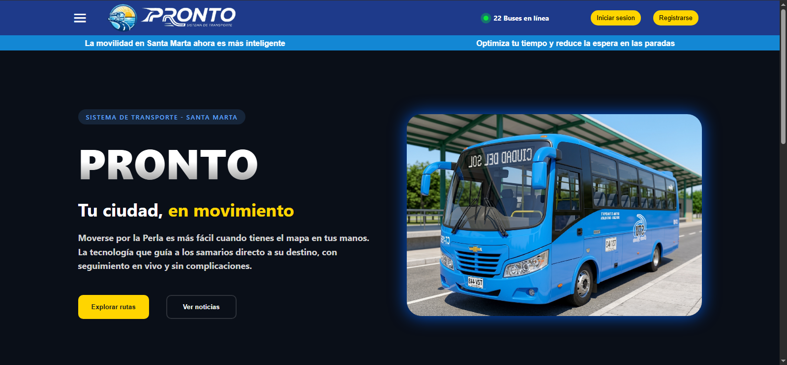

# Pronto 

## Descripción

**Pronto** es una aplicación web full-stack diseñada para ayudar a los ciudadanos a rastrear, gestionar y conocer las rutas de transporte público (buses) en tiempo real. 

Este proyecto fue desarrollado para solucionar el problema de la falta de información sobre las rutas de transporte local, permitiendo a los usuarios visualizar mapas, paradas y buses activos de forma interactiva. 

Su desarrollo se centró en la creación de una arquitectura robusta dividiendo el sistema en un Frontend moderno y reactivo, y un Backend seguro conectado a una base de datos en la nube.

---

## Capturas

**Página Principal**  



---

## Tecnologías

Este proyecto utiliza un stack tecnológico moderno (MEVN-ish + PostgreSQL):

**Frontend:**
- Vue.js (Vue CLI)
- HTML5 & CSS3
- Vercel (Despliegue)

**Backend:**
- Node.js
- Express.js
- Supabase (PostgreSQL)
- Render (Despliegue)
- JWT & bcrypt (Autenticación)

---

## Características Principales

- **Mapa interactivo:** Visualización de rutas, paradas y la ubicación de los buses en tiempo real.
- **Autenticación segura:** Sistema de registro e inicio de sesión encriptado con JWT.
- **Asistente virtual:** Chat interactivo preprogramado para guiar a los usuarios dentro de la aplicación.
- **Sistema de reportes:** Los usuarios pueden enviar comentarios o alertas sobre el estado de las rutas.
- **Panel de administración:** Gestión del perfil y consulta de buses activos.
- **Diseño responsive:** Interfaz adaptable tanto a computadoras de escritorio como a dispositivos móviles.

---

## Aprendizajes

Durante el desarrollo e implementación de este proyecto fortalecí mis conocimientos en:

- Arquitectura Full-Stack (separación de responsabilidades entre Frontend y Backend).
- Migración y manejo de bases de datos relacionales en la nube (de MySQL a PostgreSQL usando Supabase).
- Autenticación y autorización basada en tokens (JWT).
- Despliegue de aplicaciones en múltiples entornos (Vercel para interfaces y Render para servidores lógicos).
- Manejo de promesas (`async/await`) en entornos Node.js.
- Consumo de APIs RESTful usando `fetch` y `axios`.

---

## Instalación Local

Si deseas correr este proyecto en tu propia máquina:

### 1. Clonar el repositorio
```bash
git clone https://github.com/tu-usuario/pronto.git
cd pronto/miappvue
```

### 2. Configurar el Frontend
```bash
npm install
npm run serve
```

### 3. Configurar el Backend (En otra terminal)
```bash
cd backend
npm install
# Crea un archivo .env con tu DATABASE_URL de Supabase
npm start
```

---

## Demo

🔗 **[Visita Pronto aquí (Tu link de Vercel)](https://rastreador-buses.vercel.app/)**

---

## Equipo de Desarrollo

Proyecto desarrollado por:
- **Camilo Celedón**
- **Camilo Rodríguez**
- **David Mejía**
